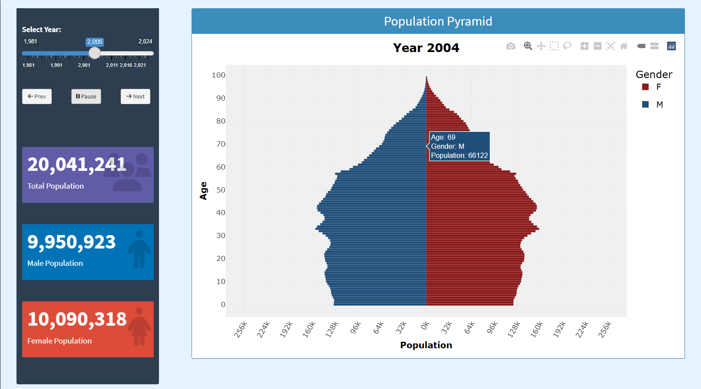
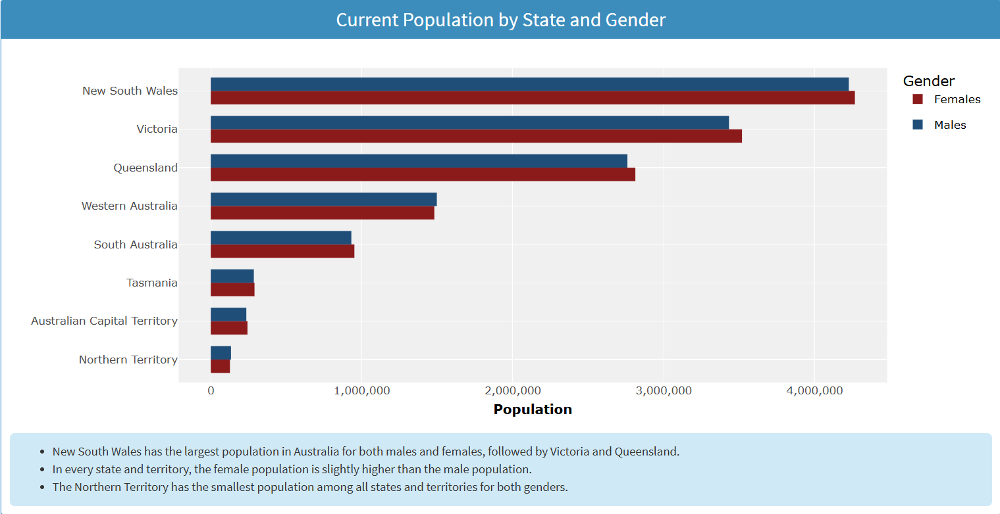

# Health Data Dashboard – Australia *(Ongoing...)*

This interactive dashboard visualizes key health and demographic trends in Australia using R Shiny.  
It is developed as part of the mini project for STA 322 2.0 Medical Statistics 2025/26.
## Objectives
- Visualize demographic trends
- Analyze health indicators over time
- Explore disease patterns
- Build an interactive dashboard

## Data Visualization
<!-- Side-by-side R and X̄ charts -->
<table>
<tr>
<td>

</td>
<td>

</td>
</tr>
</table> 

## Technologies
- R
- Shiny
- tidyverse
- ggplot2

